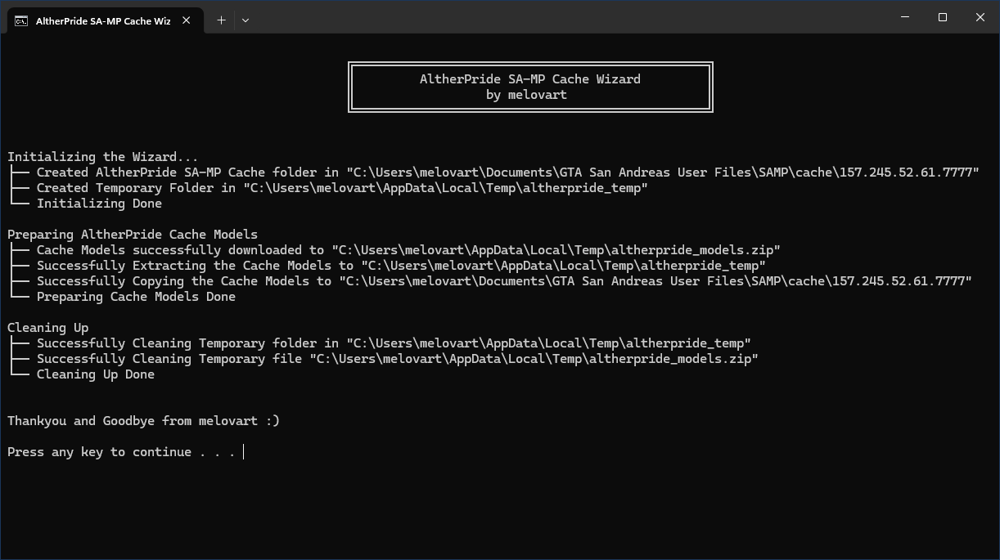

## Automatic Program Download AltherPride Models

This program is a **Batch Utility** designed to automatically download the SA-MP (San Andreas Multiplayer) model cache, with a command-line interface. **Not recommended** for those who already have the latest AltherPride cache models.

### Installation Preview
This script has been tested locally and only downloads the official AltherPride cache models.

### What does this program do?
- Create a temporary folder at `%TEMP%`
- Download the latest cache file from the AltherPride server
- Scan the directory `C:\Users\...\Documents\GTA San Andreas User Files\SAMP\cache`
- Extract and copy the cache files to the target directory
- Clean temporary files and leftover data after the process is complete

### Notes
This script only supports **Windows with PowerShell**.  
Make sure your internet connection is stable before running this program, and make sure you have access rights to the SA-MP cache directory.
